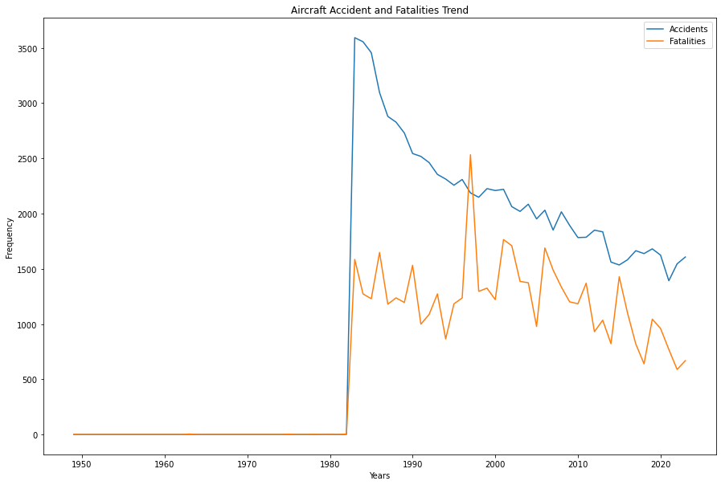
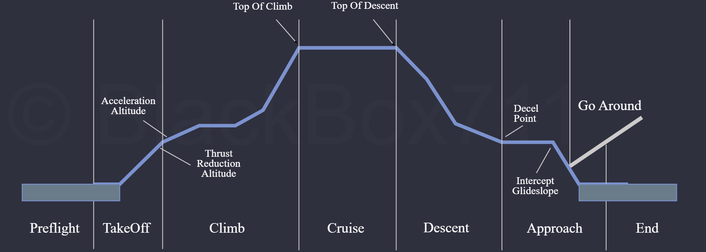
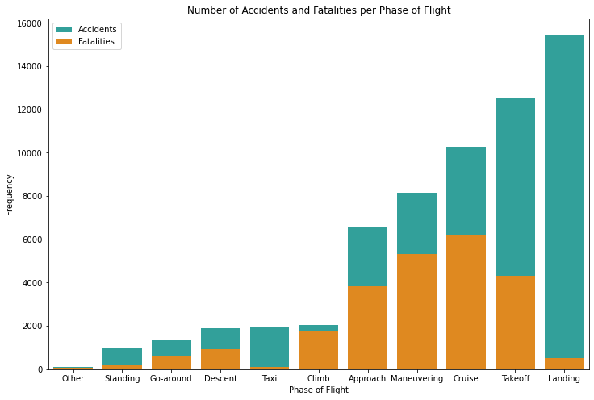
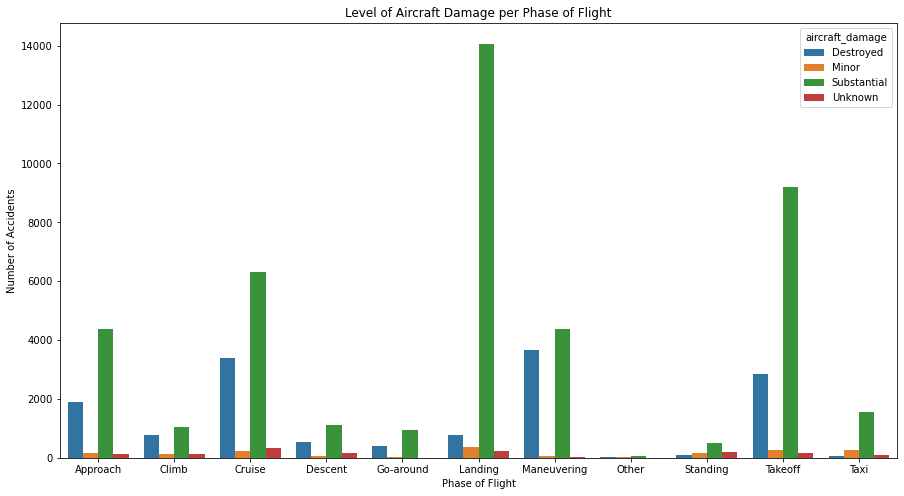
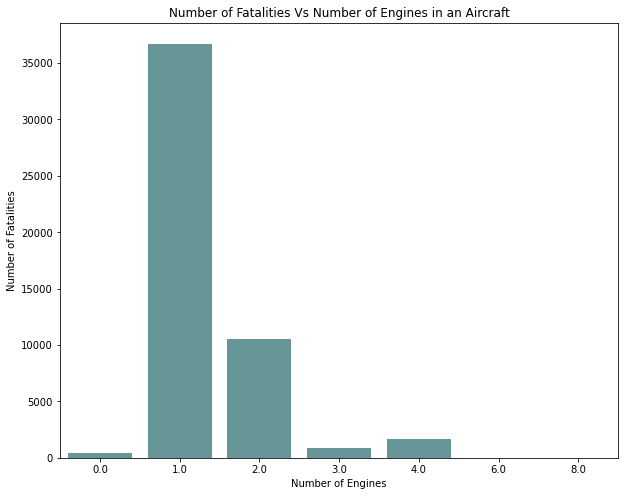

# Airplane Analysis
## Overview
My company is planning to expand into the aircraft industry, and is interested in purchasing and operating airplanes for both commercial and private enterprises. Since this is a novel business venture for the organization, an analysis of aircraft data has been conducted in order to identify potential risks and acquire useful insights that the company can utilize as it diversifies its portfolio.

## Business Understanding
The objective of this analysis is to determine if delving into the aircraft industry is worthwhile for the company, and to identify which types of aircrafts the company should purchase to reduce risks.
To achieve this, the following questions were investigated:

1. What is the trend of aircraft accidents and fatalities over the years?
2. Which Phases of Flight are prone to more accidents? Which phases result in more fatalities and which phases result in more damage to the aircraft?
3. Is there a relation between number of engines on an aircraft and fatalities in an accident?

## Data Understanding, Preparation and Analysis
For this analysis, I used a dataset from the National Transportation Safety Board that includes accident data from 1962 to 2023. The data contains records of civil aviation accidents and selected incidents in the USA and international waters. The dataset contains 90,348 records with 31 columns. 

For ease of analysis, only the columns of interest were be retained. These are the `investigation_type`, `event_date`, `aircraft_damage`, `number_of_engines`, `total_fatal_injuries` and `broad_phase_of_flight` columns.

### Missing Values
Most of the columns in the dataset had missing values. These were dealt with by deleting records with missing values, assigning missing values to a specific category for columns with catgorical data, and by imputing missing values with appropriate values for columns with numerical data. 

Upon cleaning the data, the final dataset contained 88,889records with 6 columns.

### Data Analysis
#### Trend of aircraft accidents and fatalities over the years?
To answer our first question, a line graph is used to observe the trend of aircraft accidents and fatal injuries resulting from these accidents over the years.

  

It can be noted that the number of aircraft accidents continues to decrease over the years. Similarly, the number of fatal injuries has also reduced over the years.

#### Aircraft Accidents at Different Phases of Flight
The image below highlights different phases of flight for aircrafts.

  

In this section, the total number of accidents that occurred in each phase of flight over the years were investigated. The number of fatal injuries and the level of damage done to the aircraft at each phase of flight was also investigated.

The bar chart below showcases the number of accidents and fatal injuries recorded at each phase.

  

Although the Landing and Takeoff phases of flight have the most occurrences of accidents, very few of them result in fatalities. The highest number of fatalities is instead experienced in accidents that occur in the cruise phase. Although cruise is generally a safer phase of flight compared to Landing and Takeoff, the risk of fatalities is much higher when accidents occur.

The chart below shows the level of damage done to the plane at each phase.

  

As noted earlier, most accidents occur at the Landing and Takeoff phase of flight. In addition to this, it seems that in the occurrence of these accidents, a substantial amount of damage is done to the aircraft. For the phases that have a higher risk of having fatalities (Cruise, Maneuvering), the aircrafts tend to be destroyed in the event of an accident.

#### Relation between number of engines in an aircraft and fatalities in the occurrence of an accident
Finally, an analysis was done to investigate if there is any relation between the number of engines in an aircraft and the fatalities in the event of an accident. The bar graph below shows the number of engines in an aircraft and the number of fatal injuries for aircrafts with that number of engines.

  

It can be observed that the highest number of fatalities occurs when the aircraft has only one engine.

### Conclusion
It is said that airplanes are the safest mode of transportation. Indeed, it can be observed from this analysis that the number of aircraft accidents and fatalities have significantly reduced over the years.

However, it is important to note situations that lead to occurrences of these accidents. From this analysis, it's apparent that majority of aircraft accidents occur at the Landing phase of flight and the Takeoff phase of flight. This means that aircrafts are at the highest risk of crashing at the beginning and the end of a flight, when pilots have little time to react if something goes wrong. Additionally, aircrafts are also more likely to experience turbulence and bird strikes at these low altitudes. It is also in these phases of flight where the aircrafts are substantially damaged in the event of an accident. However, it is rather encouraging to note that the number of fatalities recorded in these two phases are quite low.

The analysis also shows that there is a higher risk of fatal injuries in accidents that involve aircrafts with only one engine while those with more than one engine have less fatal injuries.

In conclusion, the aircraft industry is a worthwhile business venture for the company given that a lot of effort has been put into advancing the technology used in airplanes to make them safer. Investing in aircrafts that have sophisticated auto-pilot and auto-landing systems will be beneficial as this will enhance flight precision and reduce number of accidents at Landing and Takeoff. Finally, it is also advisable for the company to invest in aircrafts that have at least two engines, to further reduce the risk of fatalities.

## Links
Presentation slides: [Slides](https://github.com/SharonWM/airplane_analysis/blob/main/presentation.pdf)

Interactive dashboard: [Tableau Dashboard](https://public.tableau.com/views/Aviation-data-analysis/AviationDataAnalysisDashboard?:language=en-US&publish=yes&:sid=&:redirect=auth&:display_count=n&:origin=viz_share_link)